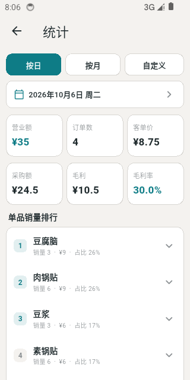
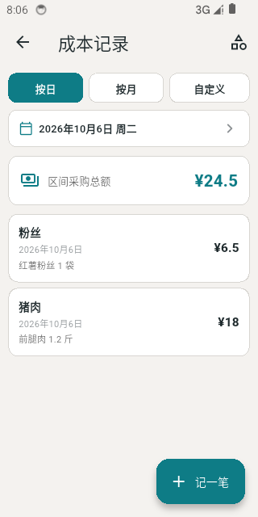

# 和宝小吃 · hebao_pos

<!-- 若仓库名不是 zichenmoshang/hebao_pos，请替换下方 CI 徽章链接 -->

[](https://github.com/zichenmoshang/hebao_pos/actions/workflows/ci.yml)
[](LICENSE)
[](https://flutter.dev)
[](https://flutter.dev)

> 面向早餐店、小吃摊的安卓离线收银算价 App。不接入任何支付渠道，只做一件事：**顾客说完要什么，3 秒内算出该付多少钱**。

## 界面预览





## 特性

- **连点计价**：点一下商品卡片加一个，超大点击区，忙乱防误触
- **快捷数量**：选中商品后一键设为 2~9 个；数字键盘支持任意数量
- **金额常驻**：超大字号实时总价，店主、顾客都能一眼看到
- **一键结账**：自动清零并记入今日流水，顶部轻提示不遮挡操作
- **经营统计**：按日 / 月 / 自定义区间查看流水、订单数、客单价、单品销量与趋势
- **成本记录**：只记原材料采购金额（猪肉、面粉、粉丝等，类目可自定义），并估算区间毛利
- **完全离线**：数据存本地 SQLite，无需注册登录、无需联网

## 下载安装

店主无需懂开发，直接安装预编译 APK：

1. 前往 [Releases](https://github.com/zichenmoshang/hebao_pos/releases) 下载最新版 APK；
2. 在安卓机上允许"安装未知来源应用"后安装。

- **最低系统**：Android 7.0（API 24）
- Release 正式发布后此节会附版本说明与更新内容（见 [CHANGELOG.md](CHANGELOG.md)）

## 隐私与数据安全

- Release 包**不申请网络权限**（`INTERNET` 仅存在于 debug/profile 构建，供热重载调试，不会进入发布包）
- 无账号注册、无埋点统计、无数据上报、不连接任何服务器
- 全部数据（订单、商品、成本）存于应用私有目录的本地 SQLite 数据库，商品图片同样存于私有目录；**卸载即全部清除**
- 经营数据导出通过系统分享面板（share_plus）完成，不经任何第三方服务

## 适用范围与限制

- 仅支持 **Android**（7.0+），不支持 iOS / 桌面 / Web
- 仅中文界面、人民币（¥）计价
- **单设备单机使用**：无云同步、无多员工账号；换机不自动迁移数据（可用 Excel 导出留存）
- 明确不做：支付收款、线上点单 / 外卖 / 会员、库存进销存、按两 / 斤单位换算

## 项目状态

当前版本 **v1.0.0**，由个人独立维护，面向真实小店场景持续迭代。版本号遵循语义化版本，变更记录见 [CHANGELOG.md](CHANGELOG.md)。使用中遇到问题欢迎提 Issue。

## 技术栈

| 项 | 选型 |
|---|---|
| 框架 | Flutter（仅 Android） |
| 状态管理 | Riverpod |
| 本地存储 | SQLite（drift / sqlite3） |
| 架构 | feature-first 分层 |

详见 [docs/architecture/overview.md](docs/architecture/overview.md)。

## 快速开始（开发者）

环境要求：

| 项 | 要求 |
|---|---|
| 平台 | 仅 Android（不支持 iOS / 桌面 / Web） |
| Flutter | 较新的 stable 频道（Dart SDK ≥ 3.13.4），建议保持最新 stable |
| JDK | **JDK 17**（Gradle 9.3 + AGP 9.1 强制要求；近期 Flutter 已自带 JDK 17，可用 `flutter config --jdk-dir` 指定） |
| Android SDK | 已安装 Platform / Build-Tools，并接受许可：`flutter doctor --android-licenses` |
| Gradle | 无需单独安装，由仓库内 Gradle Wrapper（9.3.1）自动提供 |

先确认工具链：

```bash
flutter doctor
```

> 说明：`android/local.properties`（本机 Android/Flutter SDK 路径）会在 `flutter pub get` / `flutter run` 时**自动生成**，且已被 `.gitignore` 忽略，无需手动创建，也不要提交。

运行：

```bash
flutter pub get
flutter run
```

模拟器的创建、启动与多机型分辨率适配测试见 [docs/android_emulator.md](docs/android_emulator.md)。

## 构建 Release APK

```bash
flutter build apk --release

# 按 CPU 架构分包，每个包体积更小（按需选装）
flutter build apk --split-per-abi --release
```

产物位于 `build/app/outputs/flutter-apk/`。未配置正式签名时（见下节），产物使用 debug 签名，**不能与正式签名版本互相覆盖安装**。

## 国内镜像（可选）

仓库默认使用官方源（pub.dev / Google Maven / Maven Central / services.gradle.org）。国内网络环境可通过**本机配置**加速，无需修改仓库内任何文件。

Pub / Flutter 引擎制品：

PowerShell（Windows）：

```powershell
$env:PUB_HOSTED_URL="https://pub.flutter-io.cn"
$env:FLUTTER_STORAGE_BASE_URL="https://storage.flutter-io.cn"
```

macOS / Linux：

```bash
export PUB_HOSTED_URL=https://pub.flutter-io.cn
export FLUTTER_STORAGE_BASE_URL=https://storage.flutter-io.cn
```

需要长期生效可写入系统环境变量（Windows：`setx PUB_HOSTED_URL https://pub.flutter-io.cn`）或 shell 配置文件。

Gradle 依赖：在 `~/.gradle/init.gradle`（Windows 为 `C:\Users\<你>\.gradle\init.gradle`）中放入：

```groovy
beforeSettings { settings ->
    settings.pluginManagement.repositories {
        maven { url 'https://maven.aliyun.com/repository/gradle-plugin' }
        maven { url 'https://maven.aliyun.com/repository/google' }
        maven { url 'https://maven.aliyun.com/repository/central' }
        gradlePluginPortal()
        google()
        mavenCentral()
    }
}

allprojects {
    repositories {
        maven { url 'https://maven.aliyun.com/repository/google' }
        maven { url 'https://maven.aliyun.com/repository/central' }
        google()
        mavenCentral()
    }
}
```

若 Gradle 发行包（约 200MB）下载缓慢，可临时把 `android/gradle/wrapper/gradle-wrapper.properties` 中的 `distributionUrl` 改为 `https://mirrors.cloud.tencent.com/gradle/gradle-9.3.1-all.zip`，**该改动仅用于本机加速，请勿提交**。

## 正式签名（可选）

仓库不包含任何签名材料，克隆后可直接构建（release 自动回退 debug 签名）。需要发布正式包时：

1. 用 `keytool` 生成自己的 keystore；
2. 在 `android/key.properties` 中配置（该文件与 `*.jks` 均已被 .gitignore 忽略，请勿提交）：

```properties
storePassword=你的库密码
keyPassword=你的密钥密码
keyAlias=你的别名
storeFile=../release.jks
```

`storeFile` 路径相对于 `android/app` 目录。该文件存在时，release 构建自动使用正式签名。

## 文档

- [产品需求文档](docs/product/prd.md)
- [交互说明](docs/product/interaction.md)
- [架构总览](docs/architecture/overview.md)
- [数据库设计](docs/architecture/database.md)
- [Android 模拟器调试](docs/android_emulator.md)
- [更新日志](CHANGELOG.md)

## 参与贡献

欢迎 Issue 与 PR，请先阅读 [CONTRIBUTING.md](CONTRIBUTING.md)。

## 商标声明

本项目以 MIT 许可证开源，但 MIT **不授予任何商标授权**。「和宝小吃」名称、应用图标及相关标识的商标权归版权方所有。

你可以自由地使用、修改、分发本软件；但在公开发布衍生版本时（包括 fork 后重新分发二进制、上架应用商店等），**不得冒名发布**，必须完成以下更换：

1. 应用名称与所有面向用户的文案中不得再使用「和宝小吃」或近似名称；
2. 更换应用图标及其他视觉标识，不得使用原图标或足以造成混淆的近似标识；
3. 修改 `android/app/build.gradle.kts` 中的 `applicationId`（当前为 `com.hebao.hebao_pos`）及对应的 Kotlin 包名，避免与原版包冲突、无法上架。

## License

[MIT](LICENSE)
